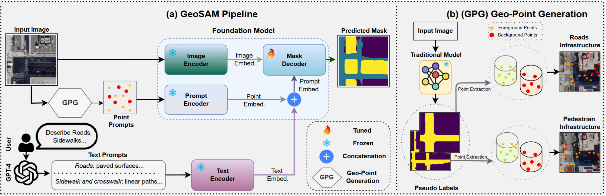

# [ECAI 25] GeoSAM: Fine-tuning SAM with Multi-Modal Prompts for Mobility Infrastructure Segmentation

Hello,
This is an updated version of GeoSAM, here, we implement a fine-tuning approach with automatically generated multi-modal prompts, specifically, point prompts from a pre-trained, task-specific traditional model, complemented by text prompts provided by users.

If you have any questions, fill out this [form](https://forms.gle/yagVwyw89mUbYb879)  or just email me at hm4013@wayne.edu. I will get back to you as soon as possible.

See the [demo](https://github.com/rafiibnsultan/GeoSAM/blob/GeoSAM_with_text/demo/) here.

Contrasting with the previous version, which you can find in the <a href="https://github.com/rafiibnsultan/GeoSAM/tree/GeoSAM_old">GeoSAM_old branch</a>.

In the previous approach, we were using feature embeddings from a traditional model to create dense prompts which was assisting our sparse or click prompts generation. However, in the new version, we have decided to use the assistance of natural language. So, instead of dense prompts, we use text prompts from natural language to provide SAM with a more natural language context to assist the click prompts. We incorporate a multi-prompts system by using texts as direct prompts for SAM which aids the model by providing more semantic context. 


Also, please find the <a href="https://waynestateprod-my.sharepoint.com/:u:/g/personal/hm4013_wayne_edu/EYnxUCLByk5Cp684H_xKK4UBaeXUY02VLaeJTZSoyubZTQ?e=W2hMN6">link</a> for the weights.

## 📰 News
🚀 Excited to share that our paper **"GeoSAM: Fine-tuning SAM with Multi-Modal Prompts for Mobility Infrastructure Segmentation"** has been accepted to the **28th European Conference on Artificial Intelligence (ECAI 2025)**.

📄 Paper link: https://ebooks.iospress.nl/doi/10.3233/FAIA250844

**Additional Updates**
1. 📦 We are sharing our dataset!  
   👉 *https://waynestateprod-my.sharepoint.com/:u:/g/personal/hm4013_wayne_edu/EaWzte2OVP1Ij_1grX-b3XYBsnCWCAKZRAILOLFdq6bpxg?e=WX66IV*  
2. 🎥 Presentation of the paper is now available!  
   👉 *https://www.youtube.com/watch?v=bA53hsqCHEk*

## Abstract:
<p class="justified-text">In geographical image segmentation, performance is often constrained by the limited availability of training data and a lack of generalizability, particularly for segmenting mobility infrastructure such as roads, sidewalks, and crosswalks. Vision foundation models like the Segment Anything Model (SAM), pre-trained on millions of natural images, have demonstrated impressive zero-shot segmentation performance, providing a potential solution. However, SAM struggles with geographical images, such as aerial and satellite imagery, due to its training being confined to natural images and the narrow features and textures of these objects blending into their surroundings. To address these challenges, we propose Geographical SAM (GeoSAM), a SAM-based framework that fine-tunes SAM using automatically generated multi-modal prompts. Specifically, GeoSAM integrates point prompts from a pre-trained task-specific model as primary visual guidance, and text prompts generated by a large language model as secondary semantic guidance, enabling the model to better capture both spatial structure and contextual meaning. GeoSAM outperforms existing approaches for mobility infrastructure segmentation in both familiar and completely unseen regions by at least 5% in mIoU, representing a significant leap in leveraging foundation models to segment mobility infrastructure, including both road and pedestrian infrastructure in geographical images.</p>



## Acknowledgement
We want to thank these two works for their open-source code and contributions to the respective fields!

<a href="https://openaccess.thecvf.com/content/ICCV2023/html/Kirillov_Segment_Anything_ICCV_2023_paper.html">Segment Anything Model (SAM)</a>

<a href="https://proceedings.aesop-planning.eu/index.php/aesopro/article/view/39">MAPPING THE WALK: A SCALABLE COMPUTER VISION APPROACH FOR GENERATING SIDEWALK NETWORK DATASETS FROM AERIAL IMAGERY.</a>

## Grant Information
This work was supported by the U.S. National Science Foundation (NSF), Innovation and Technology Ecosystems (ITE), under Award Number 2235225 as part of the NSF Convergence Accelerator Track H: _Leveraging Human-Centered AI Microtransit to Ameliorate Spatiotemporal Mismatch between Housing and Employment for Persons with Disabilities_. We thank the Innovation and Technology Ecosystems program for their invaluable contributions.

Any opinions, findings, and conclusions or recommendations expressed in this material are those of the authors and do not necessarily reflect the views of the National Science Foundation.


## Citations

If these codes are helpful for your study, please cite:

```bibtex
@inproceedings{DBLP:conf/ecai/SultanL0KBZ25,
  author       = {Rafi Ibn Sultan and
                  Chengyin Li and
                  Hui Zhu and
                  Prashant Khanduri and
                  Marco Brocanelli and
                  Dongxiao Zhu},
  editor       = {In{\^{e}}s Lynce and
                  Nello Murano and
                  Mauro Vallati and
                  Serena Villata and
                  Federico Chesani and
                  Michela Milano and
                  Andrea Omicini and
                  Mehdi Dastani},
  title        = {GeoSAM: Fine-Tuning {SAM} with Multi-Modal Prompts for Mobility Infrastructure
                  Segmentation},
  booktitle    = {{ECAI} 2025 - 28th European Conference on Artificial Intelligence,
                  25-30 October 2025, Bologna, Italy - Including 14th Conference on
                  Prestigious Applications of Intelligent Systems {(PAIS} 2025)},
  series       = {Frontiers in Artificial Intelligence and Applications},
  pages        = {501--508},
  publisher    = {{IOS} Press},
  year         = {2025},
  url          = {https://doi.org/10.3233/FAIA250844},
  doi          = {10.3233/FAIA250844},
  timestamp    = {Thu, 19 Feb 2026 17:28:40 +0100},
  biburl       = {https://dblp.org/rec/conf/ecai/SultanL0KBZ25.bib},
  bibsource    = {dblp computer science bibliography, https://dblp.org}
}
