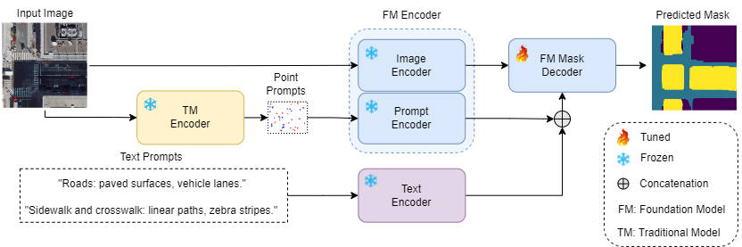

# GeoSAM: Fine-tuning SAM with Multi-Modal Prompts for Mobility Infrastructure Segmentation

Hello,
This is an updated version of GeoSAM, here, we implement a fine-tuning approach with automatically generated multi-modal prompts, specifically, point prompts from a pre-trained, task-specific traditional model, complemented by text prompts provided by users.

If you have any questions, fill out this [form](https://forms.gle/yagVwyw89mUbYb879)  or just email me at hm4013@wayne.edu. I will get back to you as soon as possible.

See the [demo](https://github.com/rafiibnsultan/GeoSAM/blob/GeoSAM_with_text/demo/) here.

Contrasting with the previous version, which you can find in the <a href="https://github.com/rafiibnsultan/GeoSAM/tree/GeoSAM_old">GeoSAM_old branch</a>.

In the previous approach, we were using feature embeddings from a traditional model to create dense prompts which was assisting our sparse or click prompts generation. However, in the new version, we have decided to use the assistance of natural language. So, instead of dense prompts, we use text prompts from natural language to provide SAM with a more natural language context to assist the click prompts. We incorporate a multi-prompts system by using texts as direct prompts for SAM which aids the model by providing more semantic context. We will provide a copy of the updated manuscript whenever it is ready.


Also, please find the <a href="https://waynestateprod-my.sharepoint.com/:u:/g/personal/hm4013_wayne_edu/EYnxUCLByk5Cp684H_xKK4UBaeXUY02VLaeJTZSoyubZTQ?e=W2hMN6">link</a> for the weights.


## Abstract:
<p class="justified-text">The Segment Anything Model (SAM) has shown impressive performance when applied to natural image segmentation. However, it struggles with geographical images like aerial and satellite imagery, especially when segmenting mobility infrastructure including roads, sidewalks, and crosswalks. This inferior performance stems from the narrow features of these objects and their textures blending into the surroundings. To address these challenges, we propose Geographical SAM (GeoSAM), a novel SAM-based framework that implements a fine-tuning approach with automatically generated multi-modal prompts, specifically, point prompts from a pre-trained, task-specific traditional model, complemented by text prompts provided by users. GeoSAM uses point prompts to serve as the main guidance for the model, Whereas text prompts act as secondary prompts, providing a semantic understanding of natural language to enhance the model's comprehension abilities. The proposed GeoSAM outperforms existing approaches for geographical image segmentation, specifically by 30%, and 7% for road infrastructure, and pedestrian infrastructure, respectively, representing a momentous leap in leveraging foundation models to segment mobility infrastructure including both road and pedestrian infrastructure in geographical images.</p>



## Acknowledgement
We want to thank these two works for their open-source code and contributions to the respective fields!

<a href="https://openaccess.thecvf.com/content/ICCV2023/html/Kirillov_Segment_Anything_ICCV_2023_paper.html">Segment Anything Model (SAM)</a>

<a href="https://proceedings.aesop-planning.eu/index.php/aesopro/article/view/39">MAPPING THE WALK: A SCALABLE COMPUTER VISION APPROACH FOR GENERATING SIDEWALK NETWORK DATASETS FROM AERIAL IMAGERY.</a>

## Grant Information
This work was supported by the U.S. National Science Foundation (NSF), Innovation and Technology Ecosystems (ITE), under Award Number 2235225 as part of the NSF Convergence Accelerator Track H: _Leveraging Human-Centered AI Microtransit to Ameliorate Spatiotemporal Mismatch between Housing and Employment for Persons with Disabilities_. We thank the Innovation and Technology Ecosystems program for their invaluable contributions.

Any opinions, findings, and conclusions or recommendations expressed in this material are those of the authors and do not necessarily reflect the views of the National Science Foundation.


## Citations

If these codes are helpful for your study, please cite:

```bibtex
@misc{sultan2024geosamfinetuningsammultimodal,
      title={GeoSAM: Fine-tuning SAM with Multi-Modal Prompts for Mobility Infrastructure Segmentation}, 
      author={Rafi Ibn Sultan and Chengyin Li and Hui Zhu and Prashant Khanduri and Marco Brocanelli and Dongxiao Zhu},
      year={2024},
      eprint={2311.11319},
      archivePrefix={arXiv},
      primaryClass={cs.CV},
      url={https://arxiv.org/abs/2311.11319}, 
}
